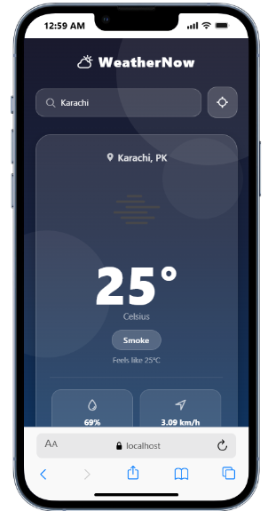
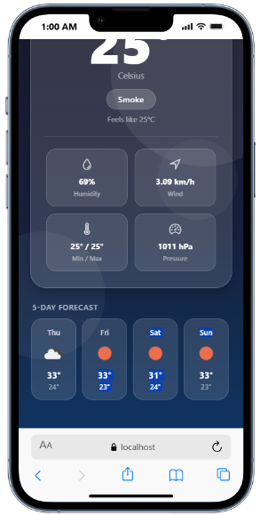

# WeatherNow — React Native Weather App

A beautiful, real-time weather app built with **React Native** and **Expo**. It displays current weather conditions and a 5-day forecast with dynamic gradient backgrounds that change based on weather conditions.

---

## Screenshots

|                  Home Screen                   |                  Forecast View                   |
| :--------------------------------------------: | :----------------------------------------------: |
|  |  |

---

## Features

- **Current Weather** — temperature, feels-like, condition, humidity, wind speed, min/max, and pressure
- **5-Day Forecast** — scrollable day-by-day forecast strip
- **Dynamic Gradients** — background changes based on weather condition (sunny, cloudy, rain, storm, snow, fog…)
- **GPS Location** — one-tap to fetch weather for your current location
- **City Search** — search any city worldwide
- **Persistent Last City** — remembers your last searched city via AsyncStorage
- **Glassmorphism UI** — frosted-glass cards with subtle decorative blobs

---

## Tech Stack

| Layer       | Technology                                |
| ----------- | ----------------------------------------- |
| Framework   | React Native + Expo ~54                   |
| Language    | JavaScript (JSX)                          |
| Navigation  | React Navigation v7                       |
| Gradients   | expo-linear-gradient                      |
| Icons       | @expo/vector-icons (Ionicons)             |
| Location    | expo-location                             |
| Storage     | @react-native-async-storage/async-storage |
| HTTP        | axios                                     |
| Weather API | OpenWeatherMap                            |

---

## Project Structure

```
weather-app/
├── App.js                  # Root entry point
├── screens/
│   └── HomeScreen.js       # Main weather screen
├── components/
│   ├── WeatherCard.js      # Weather detail card
│   └── ForecastStrip.js    # 5-day forecast strip
├── services/
│   └── weatherService.js   # OpenWeatherMap API calls
└── assets/
    ├── screen1.PNG         # App screenshot 1
    └── screen2.PNG         # App screenshot 2
```

---

## Getting Started

### Prerequisites

- [Node.js](https://nodejs.org/) (v18+)
- [Expo CLI](https://docs.expo.dev/get-started/installation/) — `npm install -g expo-cli`
- An [OpenWeatherMap API key](https://openweathermap.org/api)

### Installation

```bash
# Clone the repository
git clone https://github.com/your-username/react-native-mobile-app-expo.git
cd react-native-mobile-app-expo/weather-app

# Install dependencies
npm install
```

### Environment Setup

Create a `.env` file inside `weather-app/`:

```env
EXPO_PUBLIC_OPENWEATHER_API_KEY=your_api_key_here
```

### Run the App

```bash
# Start Expo dev server
npx expo start
```

Then scan the QR code with **Expo Go** (Android/iOS), or press:

- `a` — Android emulator
- `i` — iOS simulator
- `w` — Web browser

---

## License

This project is licensed under the [MIT License](LICENSE).
